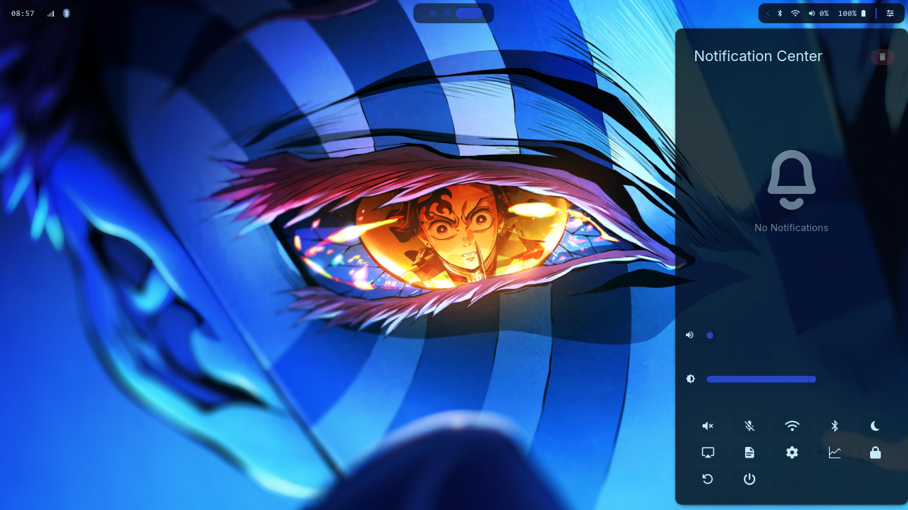
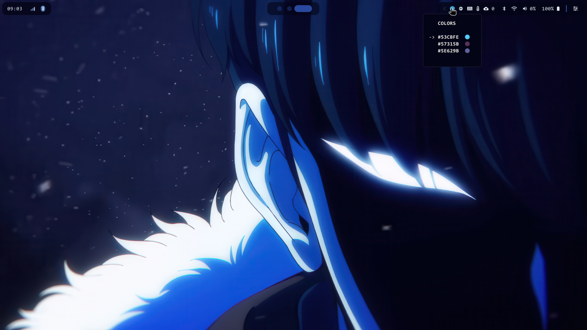

# Dotfiles

Welcome to my personal dotfiles repository!  

This collection contains configuration files and folders for the tools and applications I use daily.  

Please note that these dotfiles are a work in progress—I'm constantly experimenting, refining, and updating them as my workflow evolves.

## Tools I'm Currently Using

- Fish (Shell)
- Kitty (Terminal Emulator)
- Fuzzel (App launcher and fuzzy finder)
- Niri (Window Manager)
- Swww (Wallpaper Manager)
- Waybar (Status Bar)
- Superfile (File Manager)
- Hyprlock (Screen Locker)
- Hyprpicker (Color Picker Tool)
- Auto CpuFreq (CPU Frequency Scaling)
- Tmux (Terminal Multiplexer)
    - Tmux Configuration taken from [this repository](https://github.com/gpakosz/.tmux?tab=readme-ov-file#configuration)

---

Feel free to explore, reference, or adapt any part of this setup for your own use!

---
## Screenshots

