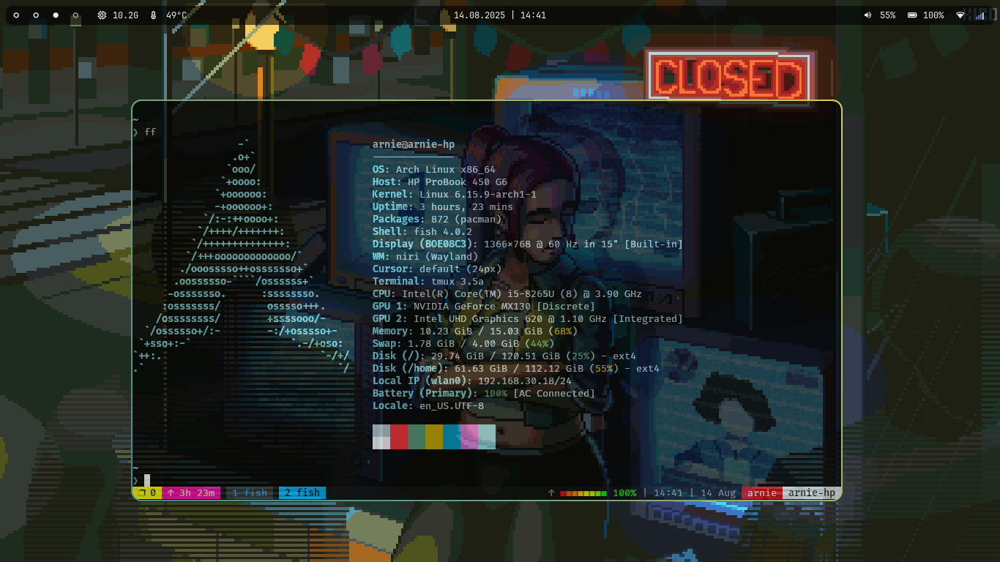
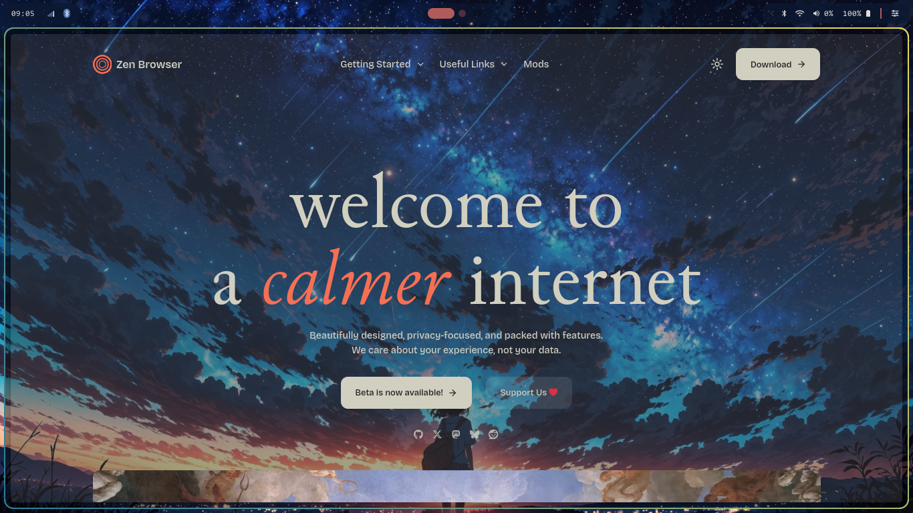
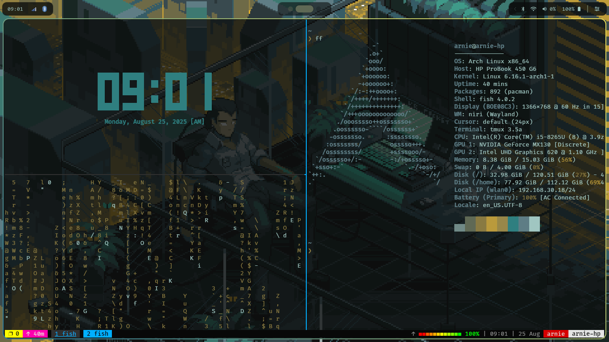
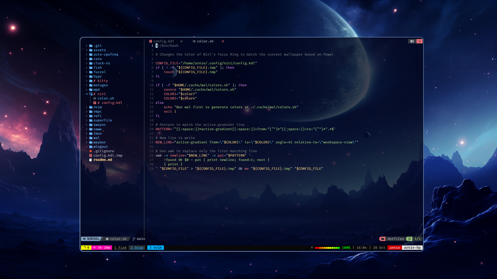
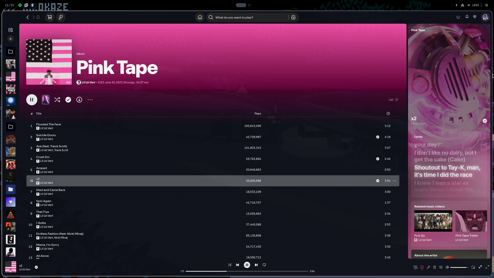
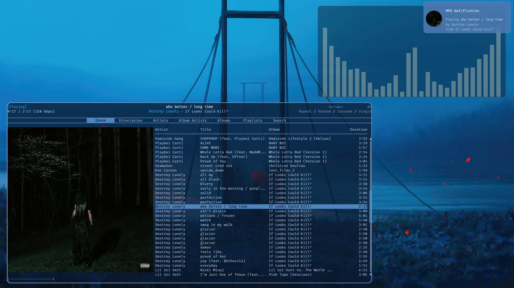

# Dotfiles

Welcome to my personal dotfiles repository!  

This collection contains configuration files and folders for the tools and applications I use daily.  

Please note that these dotfiles are a work in progress—I'm constantly experimenting, refining, and updating them as my workflow evolves.

## Tools I'm Currently Using

- Fish (Shell)
- Kitty (Terminal Emulator)
- Niri (Window Manager)
- Swww (Wallpaper handler)
- Waybar (Status Bar)
- Superfile (File Manager)
- Hyprlock (Screen Locker)
    - Hyprlock Example Configurations from [mahaveergurjar](https://github.com/mahaveergurjar/Hyprlock-Dots)
- Hyprpicker (Color Picker Tool)
- Auto CpuFreq (CPU Frequency Scaler)
- Tmux (Terminal Multiplexer)
    - Tmux Configuration referenced from [gpakosz](https://github.com/gpakosz/.tmux)

- Neovim (Text Editor)
    - Neovim Configuration referenced from [NVChad](https://nvchad.com/)

- Rofi (A window switcher, application launcher and dmenu replacement )
    - Rofi Configuration referenced from [adi1090x](https://github.com/adi1090x/rofi/tree/master)

- Pywal (Dynamic theming based on wallpaper)
- Swaync (Notification Center)
- mpd (Music Player Daemon)
    - mpdscribble (Scrobbler for mpd)
    - mpd-notification (Desktop notifications for mpd)
    - mpd-mpris (MPRIS interface for mpd)
    - rmpc (TUI client for mpd)

---

Feel free to explore, reference, or adapt any part of this setup for your own use!

---
## Screenshots

