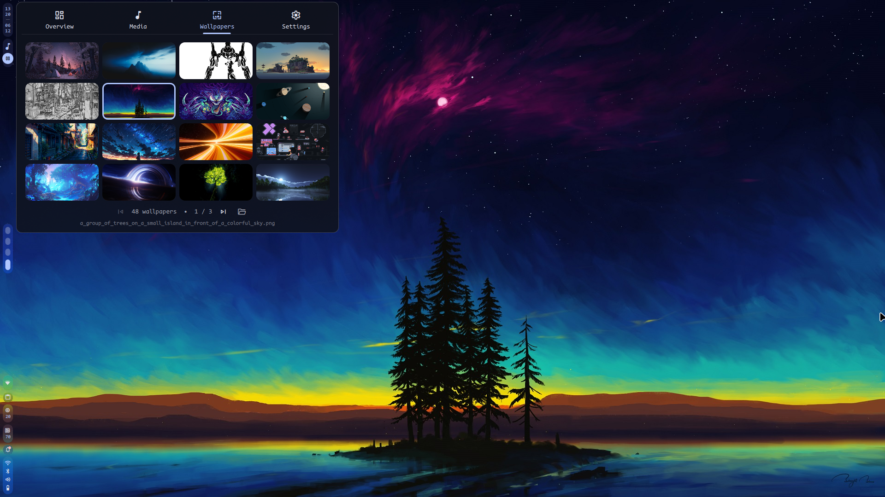
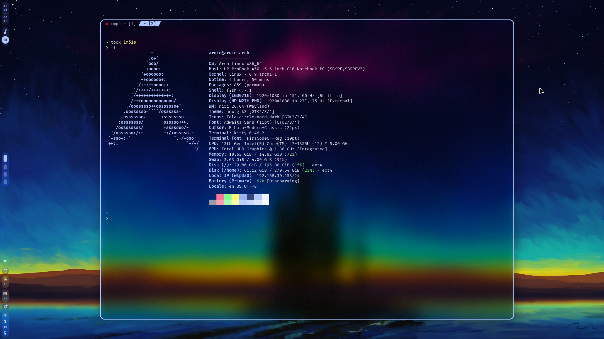
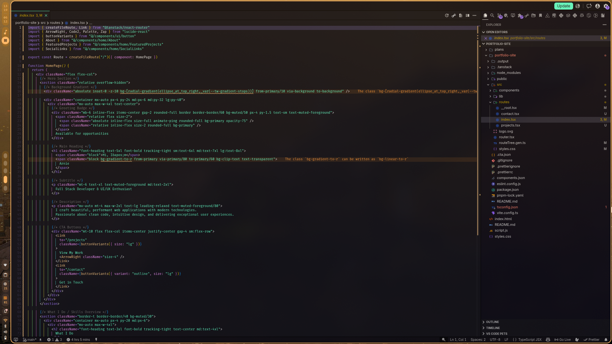
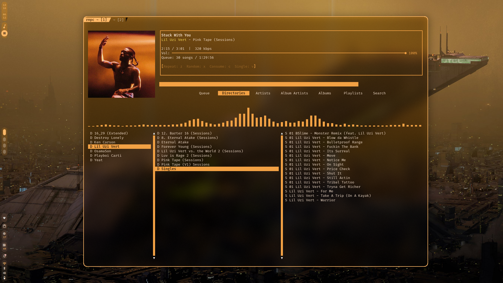
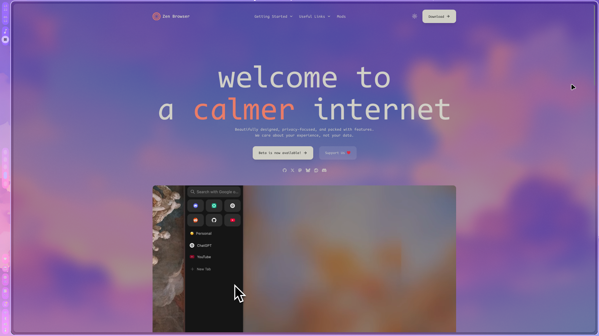
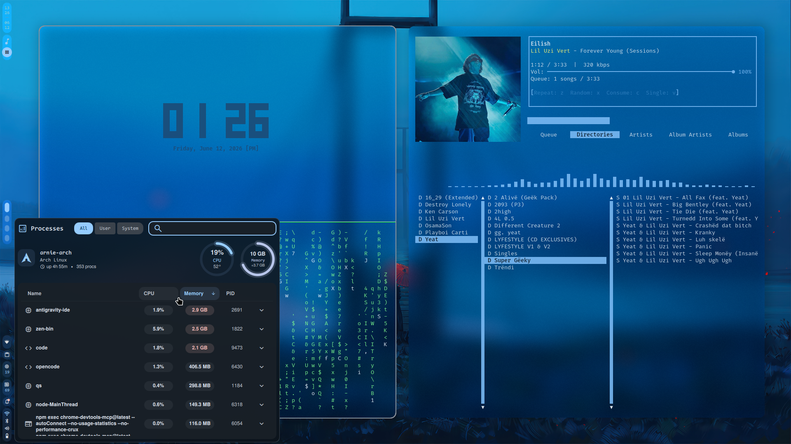
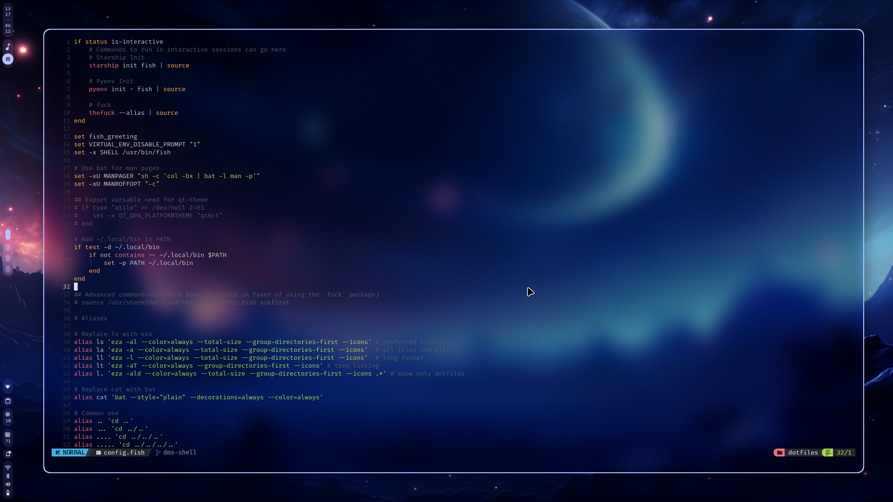

# Dotfiles

Welcome to my personal dotfiles repository!  

This collection contains configuration files and folders for the tools and applications I use daily.  

Please note that these dotfiles are a work in progress—I'm constantly experimenting, refining, and updating them as my workflow evolves.

## Tools I'm Currently Using

- Fish (Shell)
- Kitty (Terminal Emulator)
- Niri (Window Manager)
- Superfile (File Manager)
- [DankMaterialShell](https://github.com/AvengeMedia/DankMaterialShell)
    - A complete desktop shell.

- Neovim (Text Editor)
    - Neovim Configuration referenced from [NVChad](https://nvchad.com/)

- mpd (Music Player Daemon)
    - mpdscribble (Scrobbler for mpd)
    - mpd-notification (Desktop notifications for mpd)
    - mpd-mpris (MPRIS interface for mpd)
    - rmpc (TUI client for mpd)

- spotify-player (Spotify terminal client)

---

Feel free to explore, reference, or adapt any part of this setup for your own use!

---
## Screenshots

